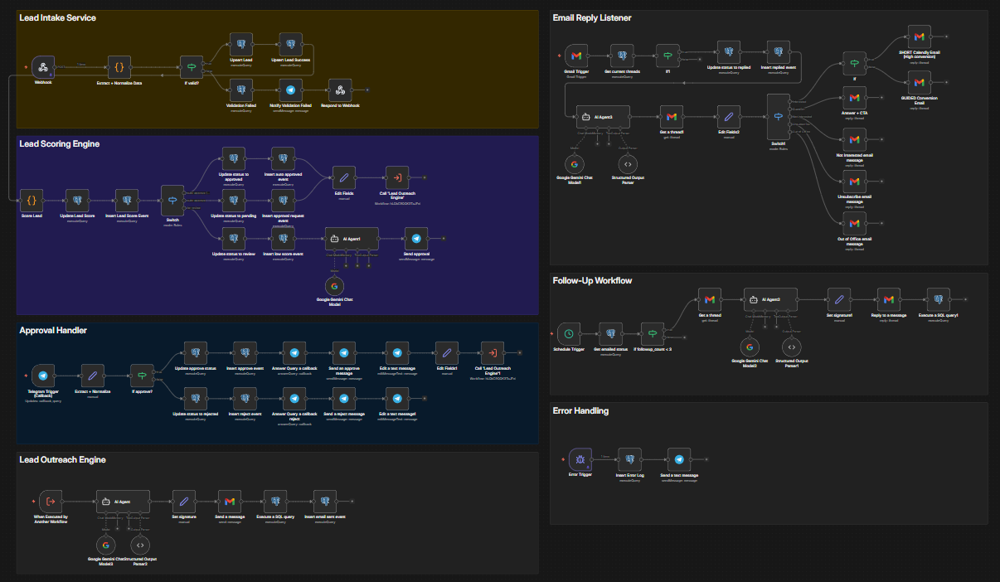

## 🚀 AI-Powered Lead Automation System

👉 Full case study: /docs/

## Overview

This project is a fully automated lead management system built using n8n.

It handles the entire lifecycle:

* Lead intake
* Data validation
* Lead scoring
* Approval workflows
* Automated outreach
* Email reply classification
* Follow-ups
* Error handling & monitoring

## Architecture

## Workflows

### 1. Lead Intake Service

Handles incoming leads via webhook, validates and stores them.

### 2. Lead Scoring Engine

Scores leads and determines next actions (approval / review / reject).

### 3. Approval Handler

Manages approval flow and triggers notifications.

### 4. Lead Outreach Engine

Sends automated messages and tracks engagement.

### 5. Email Reply Listener

Processes incoming replies and classifies intent using AI.

### 6. Follow-Up Workflow

Automates follow-ups based on lead status.

### 7. Error Handling

Captures and logs system errors and sends alerts.

## Tech Stack

* n8n
* PostgreSQL
* Telegram API
* AI (OpenAI / Google Gemini)

## Notes

* Credentials and API keys are NOT included for security reasons.
* Use `.env.example` to configure your environment.
